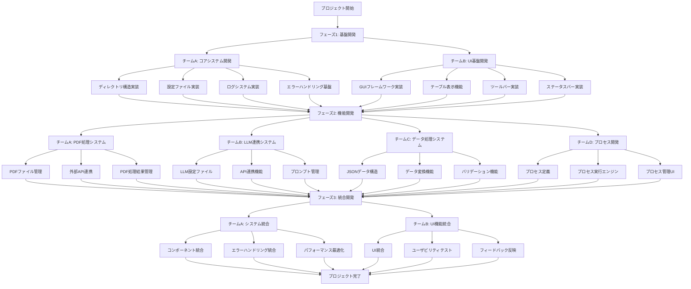

# 経費管理アプリケーション 開発計画

## 1. プロジェクト概要
PDFの領収書から情報を抽出し、経費データをJSON形式で管理するプラットフォームの開発

## 2. 開発フロー

## 3. 開発フェーズと具体的なタスク

### フェーズ1: 基盤開発（2週間）
#### チームA: コアシステム開発
- **ディレクトリ構造の実装**
  - プロジェクトのルートディレクトリを作成
  - 各経費タイプごとのディレクトリを作成（例：実験実習費、科研費、教育研究経費など）
  - 各経費ディレクトリ内に必要なサブディレクトリを作成（unprocessed, registered, applications, logsなど）
  - ディレクトリ作成用のPythonスクリプトを実装

- **設定ファイル（setting.json）の実装**
  - 各経費タイプごとの設定ファイルのテンプレートを作成
  - テーブルヘッダーとJSONフィールドのマッピングを定義
  - デフォルトのLLM設定ファイルのパスを設定
  - 設定ファイルの読み込み・検証機能を実装

- **ログシステムの実装**
  - Pythonのloggingモジュールを使用したログ機能の実装
  - ログレベル（INFO, WARNING, ERROR）の設定
  - ログファイルのローテーション機能の実装
  - ログメッセージのフォーマット定義

- **エラーハンドリング基盤の実装**
  - 例外処理の基本構造の実装
  - エラーメッセージの標準化
  - エラーログへの記録機能
  - ユーザーへのエラー通知機能

#### チームB: UI基盤開発
- **tkinterベースのGUIフレームワーク実装**
  - メインウィンドウの作成
  - メニューバーの実装
  - 基本的なレイアウト設計
  - ウィンドウサイズ調整機能

- **テーブル表示機能の実装**
  - ttk.Treeviewを使用したテーブルウィジェットの実装
  - カラムの設定と表示
  - データの表示機能
  - ソート機能の実装

- **ツールバー実装**
  - 更新ボタンの実装
  - 総額表示ラベルの実装
  - 処理ボタンの実装
  - ボタンのイベントハンドラ設定

- **ステータスバー実装**
  - ステータスメッセージ表示エリアの実装
  - エラー数・警告数表示の実装
  - ログ表示ウィンドウの実装
  - ステータス更新機能の実装

### フェーズ2: 機能開発（3週間）
#### チームA: PDF処理システム
- **PDFファイル管理システム**
  - PDFファイルのアップロード機能の実装
  - ファイル名の標準化機能
  - ファイルの移動・コピー機能
  - ファイルの削除機能

- **外部API連携機能**
  - 外部PDF処理APIのクライアント実装
  - APIリクエストの構築
  - レスポンスの処理
  - エラーハンドリング

- **PDF処理結果管理システム**
  - 処理結果のJSON形式への変換
  - 処理結果の保存機能
  - 処理履歴の管理
  - 再処理機能の実装

#### チームB: LLM連携システム
- **LLM設定ファイル実装**
  - 各LLM（Gemini, GPT-4）の設定ファイルテンプレート作成
  - APIキー管理機能の実装
  - モデルパラメータの設定
  - 設定ファイルの検証機能

- **API連携機能**
  - LLM APIクライアントの実装
  - リクエストの構築と送信
  - レスポンスの解析
  - エラーハンドリングとリトライ機能

- **プロンプト管理システム**
  - プロンプトテンプレートの管理
  - プロンプトの動的生成
  - プロンプトのバージョン管理
  - プロンプトのテスト機能

#### チームC: データ処理システム
- **JSONデータ構造の実装**
  - 領収書データのJSONスキーマ定義
  - JSONデータの生成機能
  - JSONデータの読み込み機能
  - JSONデータの検証機能

- **データ変換機能**
  - PDFデータからJSONへの変換
  - JSONからテーブル表示用データへの変換
  - データ形式の標準化
  - データの正規化処理

- **バリデーション機能**
  - 必須フィールドのチェック
  - データ型の検証
  - 値の範囲チェック
  - エラーメッセージの生成

#### チームD: プロセス開発
- **プロセス定義システム**
  - プロセス定義のJSONスキーマ作成
  - プロセスステップの定義機能
  - 条件分岐の定義機能
  - プロセステンプレートの管理

- **プロセス実行エンジン**
  - プロセスステップの実行機能
  - 条件分岐の評価機能
  - エラーハンドリング
  - 実行状態の管理

- **プロセス管理UI**
  - プロセス定義の編集UI
  - プロセス実行の制御UI
  - 実行状態の表示
  - プロセス履歴の表示

### フェーズ3: 統合開発（2週間）
#### チームA: システム統合
- **各コンポーネントの統合**
  - 各モジュール間の連携実装
  - データフローの最適化
  - 統合テストの実施
  - バグ修正

- **エラーハンドリングの統合**
  - エラー伝播の実装
  - エラー回復機能の実装
  - エラーログの統合
  - ユーザー通知の統合

- **パフォーマンス最適化**
  - 処理速度の改善
  - メモリ使用量の最適化
  - 非同期処理の実装
  - キャッシュ機能の実装

#### チームB: UI機能統合
- **各機能のUI統合**
  - 各機能のUIコンポーネント統合
  - ナビゲーションの実装
  - 一貫性のあるUIデザイン
  - レスポンシブ対応

- **ユーザビリティテスト**
  - ユーザーテストの実施
  - フィードバックの収集
  - 問題点の特定
  - 改善案の作成

- **フィードバック反映**
  - UI改善の実装
  - 使いやすさの向上
  - アクセシビリティの改善
  - ドキュメントの更新

## 4. 並列開発のポイント

### 4.1 インターフェース定義
- **各チーム間のインターフェースを明確に定義**
  - 関数の入出力仕様の定義
  - データ構造の標準化
  - イベント通知の仕組み
  - エラー処理の統一

- **データ構造の標準化**
  - JSONスキーマの定義
  - データ型の統一
  - 命名規則の統一
  - バージョン管理の仕組み

- **API仕様の統一**
  - APIエンドポイントの定義
  - リクエスト/レスポンス形式の統一
  - エラーコードの標準化
  - 認証方式の統一

### 4.2 開発環境
- **バージョン管理（Git）の徹底**
  - リポジトリの設定
  - ブランチ戦略の確立
  - コミットメッセージの規則
  - コードレビュープロセス

- **ブランチ戦略の確立**
  - feature/コアシステム
  - feature/UI基盤
  - feature/PDF処理
  - feature/LLM連携
  - feature/データ処理
  - feature/プロセス開発

### 4.3 テスト戦略
- **各チームでの単体テスト**
  - テストケースの作成
  - テスト自動化の実装
  - テストカバレッジの確保
  - テスト結果の報告

- **統合テスト環境の整備**
  - 統合テストの自動化
  - テスト環境の構築
  - テストデータの準備
  - テスト結果の分析

- **自動テストの実装**
  - CI/CDパイプラインの構築
  - 自動テストの実行
  - テストレポートの生成
  - 問題の自動検出

## 5. マイルストーン

### 週1-2: 基盤開発
- **ディレクトリ構造の完成**
  - すべての必要なディレクトリの作成
  - ディレクトリ作成スクリプトの完成
  - ディレクトリ構造のテスト

- **基本的なUI実装**
  - メインウィンドウの完成
  - 基本的なレイアウトの実装
  - テーブル表示の基本機能

- **ログシステムの完成**
  - ログ機能の実装完了
  - ログファイルの生成確認
  - ログレベルの動作確認

### 週3-5: 機能開発
- **PDF処理システムの完成**
  - PDFファイル管理機能の完成
  - 外部API連携の実装完了
  - 処理結果管理の実装完了

- **LLM連携の実装**
  - LLM設定ファイルの完成
  - API連携機能の実装完了
  - プロンプト管理の実装完了

- **データ処理システムの完成**
  - JSONデータ構造の実装完了
  - データ変換機能の完成
  - バリデーション機能の実装完了

- **プロセス開発システムの完成**
  - プロセス定義システムの完成
  - プロセス実行エンジンの実装完了
  - プロセス管理UIの実装完了

### 週6-7: 統合開発
- **システム統合の完了**
  - 各コンポーネントの統合完了
  - エラーハンドリングの統合完了
  - パフォーマンス最適化の完了

- **UI統合の完了**
  - 各機能のUI統合完了
  - ユーザビリティテストの完了
  - フィードバック反映の完了

- **最終テストの完了**
  - システム全体のテスト完了
  - バグ修正の完了
  - ドキュメントの完成

## 6. リスク管理

### 6.1 技術的リスク
- **外部APIの応答時間と安定性**
  - APIの応答時間が遅い場合の対策
  - APIが利用できない場合のフォールバック
  - APIの仕様変更への対応
  - APIの利用制限への対応

- **LLM APIの応答時間**
  - 非同期処理の実装
  - タイムアウト設定
  - リトライ機能の実装
  - キャッシュ機能の実装

- **データ整合性の確保**
  - トランザクション管理の実装
  - バックアップ機能の実装
  - データ検証の強化
  - 整合性チェックの自動化

- **プロセス実行の安定性**
  - エラーハンドリングの強化
  - リカバリー機能の実装
  - 実行状態の保存
  - 再開機能の実装

### 6.2 プロジェクトリスク
- **チーム間の連携**
  - 定期的なミーティングの実施
  - コミュニケーションツールの活用
  - 進捗共有の仕組み
  - 問題解決プロセスの確立

- **スケジュールの遅延**
  - マイルストーンの細分化
  - 優先順位の明確化
  - リソースの再配分
  - スコープの調整

- **リソースの不足**
  - リソースの効率的な配分
  - 外部リソースの活用
  - 自動化による効率化
  - スコープの調整

## 7. 品質管理

### 7.1 コード品質
- **コーディング規約の遵守**
  - PEP 8に準拠したコーディング
  - 命名規則の統一
  - コメントの充実
  - コードの可読性向上

- **コードレビューの実施**
  - レビュープロセスの確立
  - レビュー基準の明確化
  - フィードバックの提供
  - 改善の実施

- **テストカバレッジの確保**
  - 単体テストの作成
  - 統合テストの実施
  - カバレッジレポートの分析
  - 改善の実施

### 7.2 ドキュメント
- **API仕様書**
  - エンドポイントの説明
  - リクエスト/レスポンス形式
  - エラーコードの説明
  - 使用例の提供

- **ユーザーマニュアル**
  - インストール手順
  - 基本操作の説明
  - トラブルシューティング
  - よくある質問

- **開発ドキュメント**
  - アーキテクチャの説明
  - コンポーネントの説明
  - データフローの説明
  - 拡張方法の説明

## 8. 開発環境

### 8.1 必要なツール
- **Python 3.x**
  - インストール手順
  - バージョン管理
  - 仮想環境の設定
  - パッケージ管理

- **Git**
  - インストール手順
  - 基本コマンドの説明
  - ブランチ管理
  - コミット方法

- **VSCode/PyCharm**
  - インストール手順
  - 拡張機能の設定
  - デバッグ方法
  - ショートカットキー

- **tkinter**
  - インストール確認
  - 基本ウィジェットの説明
  - レイアウト管理
  - イベント処理

### 8.2 依存パッケージ
- **外部PDF処理APIクライアント**
  - インストール方法
  - 基本使用方法
  - 設定方法
  - トラブルシューティング

- **LLM APIクライアント**
  - インストール方法
  - APIキーの設定
  - 基本使用方法
  - エラーハンドリング

- **JSON処理ライブラリ**
  - インストール方法
  - 基本使用方法
  - スキーマ検証
  - パフォーマンス最適化

- **ログ管理ライブラリ**
  - インストール方法
  - 設定方法
  - ログレベル設定
  - ログローテーション

- **プロセス管理ライブラリ**
  - インストール方法
  - 基本使用方法
  - プロセス定義
  - 実行制御

## 9. 初心者向けガイド

### 9.1 開発環境のセットアップ
1. **Pythonのインストール**
   - [Python公式サイト](https://www.python.org/downloads/)から最新版をダウンロード
   - インストーラーを実行し、「Add Python to PATH」にチェックを入れる
   - インストール完了後、コマンドプロンプトで`python --version`を実行して確認

2. **VSCodeのインストール**
   - [VSCode公式サイト](https://code.visualstudio.com/)からダウンロード
   - インストーラーを実行
   - Python拡張機能をインストール（VSCode内の拡張機能タブから検索）

3. **Gitのインストール**
   - [Git公式サイト](https://git-scm.com/downloads)からダウンロード
   - インストーラーを実行（デフォルト設定でOK）
   - コマンドプロンプトで`git --version`を実行して確認

4. **プロジェクトのクローン**
   - コマンドプロンプトで`git clone [リポジトリURL]`を実行
   - クローンしたディレクトリに移動

5. **仮想環境の作成**
   - コマンドプロンプトで`python -m venv venv`を実行
   - 仮想環境を有効化（Windows: `venv\Scripts\activate`）
   - 必要なパッケージをインストール（`pip install -r requirements.txt`）

### 9.2 基本的な開発フロー
1. **タスクの理解**
   - 開発計画から担当タスクを確認
   - 必要な機能を理解
   - 実装方法を検討

2. **ブランチの作成**
   - `git checkout -b feature/機能名`で新しいブランチを作成

3. **コードの実装**
   - 必要な機能を実装
   - コメントを適切に記述
   - コードの可読性を確保

4. **テストの実施**
   - 実装した機能のテスト
   - エラーがないか確認
   - 期待通りの動作か確認

5. **コミットとプッシュ**
   - `git add .`で変更をステージング
   - `git commit -m "機能の説明"`でコミット
   - `git push origin feature/機能名`でプッシュ

6. **プルリクエストの作成**
   - GitHubでプルリクエストを作成
   - 変更内容を説明
   - レビューを依頼

### 9.3 よくある問題と解決方法
1. **Pythonのインポートエラー**
   - 仮想環境が有効になっているか確認
   - 必要なパッケージがインストールされているか確認
   - インポートパスが正しいか確認

2. **tkinterのウィンドウが表示されない**
   - メインループが実行されているか確認
   - ウィンドウの作成コードが正しいか確認
   - エラーが発生していないか確認

3. **Gitの操作エラー**
   - ブランチ名が正しいか確認
   - リモートリポジトリが正しく設定されているか確認
   - コミットメッセージが適切か確認

4. **API連携のエラー**
   - APIキーが正しく設定されているか確認
   - リクエスト形式が正しいか確認
   - ネットワーク接続が正常か確認 