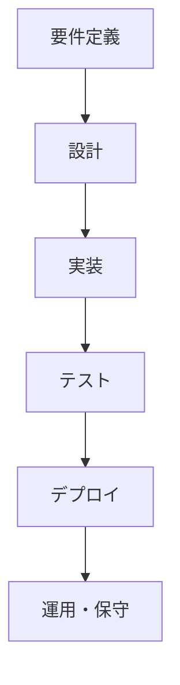
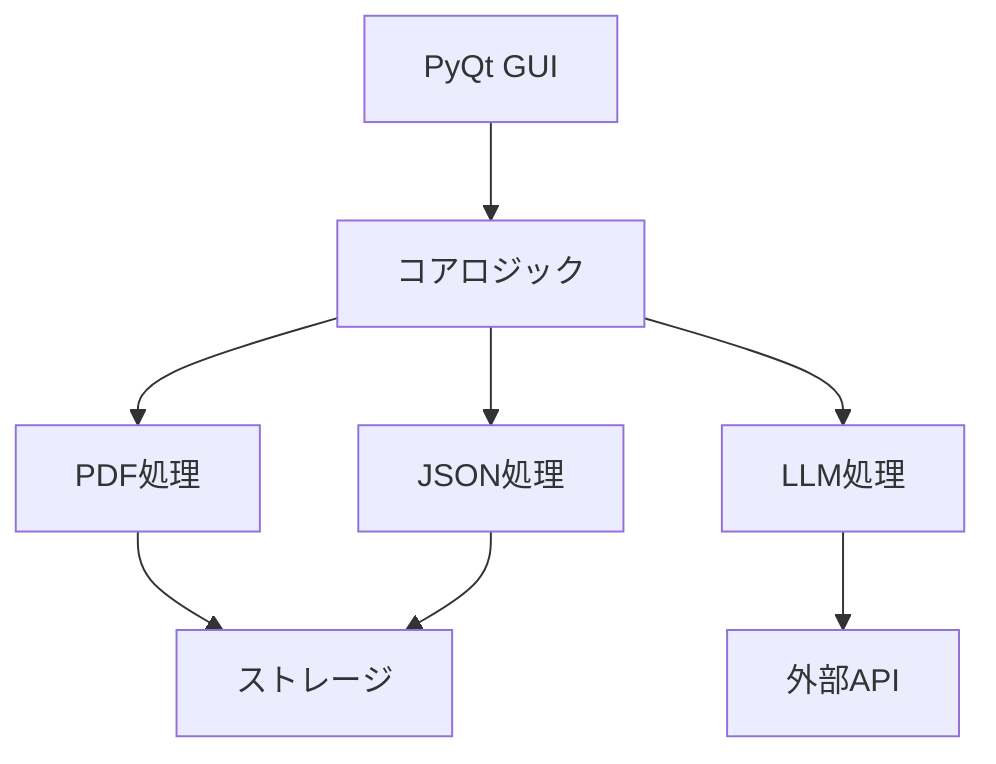
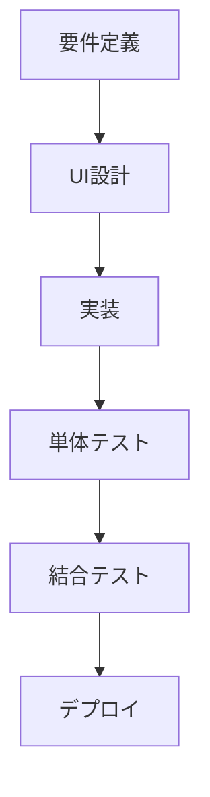

# 経費管理アプリケーション

このアプリケーションは、PDFの領収書から情報を抽出し、
経費データをJSON形式で管理するプラットフォームです。
Pythonを基本としますが、外部ツールの呼び出しは制限しません。

## 仕様

### ディレクトリ構造
- `display_json_data_gui.pyw` アプリ本体
- `requirements.txt` アプリケーションの依存パッケージを記載したテキストファイル
- `readme.md` 仕様書
- `logs` アプリケーション全体のログを格納
   - `app.log` アプリケーション全体のログ

これに加えて、経費ごとにフォルダ/ディレクトリを設置します。
各経費毎に次のような構造を構築します：

- `経費A` 経費Aのディレクトリです。ディレクトリ名がUIのテーブル名になります。
   - `setting.json` 経費Aの基本設定を行うjson. 構成は以下
      - テーブルのヘッダーと使用するjsonの対応
      - デフォルトのLLM設定ファイルのパス
   - `llm_config/` LLM設定用ディレクトリ
      - `gemini_receipt.json` Gemini API設定（領収書用）
      - `gemini_invoice.json` Gemini API設定（請求書用）
      - `gemini_delivery.json` Gemini API設定（納品書用）
      - `gpt4_receipt.json` GPT-4 API設定（領収書用）
      - `gpt4_invoice.json` GPT-4 API設定（請求書用）
      - `gpt4_delivery.json` GPT-4 API設定（納品書用）
   - `process/` 各処理に用いるスクリプト用ディレクトリ
      - `processA.py`
      - `processB.py`
      - `processB.js` Pythonで組んでいるため、Node.jsを利用する場合はprocessBから呼び出す
   - `profile/` 申請に用いるprofileを格納
      - `profileA.json` profile set A
      - `profileB.json` profile set B
   - `unprocessed/` フォルダ分けやjson生成前の領収書を格納するディレクトリ
   - `registered/` json生成後のディレクトリを格納するディレクトリ
      - `receiptA/` receiptA領収書に対応するディレクトリ（自動生成）
         - `receiptA.pdf` 処理元のPDF
         - `receiptA.json` PDFから生成されたJSONファイル（LLMでの生成を試みる）
         - その他ユーザーが追加したファイル
   - `applications/` 申請書を格納するディレクトリ
      - `20240315_1430/` 申請書フォルダ（日時）
         - `application.json` 申請情報
         - `expense_form.pdf` process出力
         - `attachments/` 必要に応じて添付資料
   - `logs/` 経費Aのログを格納
      - `process.log` 処理ログ
      - `error.log` エラーログ

### 設定ファイルの構造

#### setting.json
```json
{
  "table_headers": {
    "年": "payment_date.year",
    "月": "payment_date.month",
    "日": "payment_date.day",
    "経費種目": "expense_type",
    "発行元": "issuer",
    "品目": "items[*].product_name",
    "業者": "items[*].provider",
    "品番": "items[*].model",
    "個数": "items[*].number",
    "領収書等": "title",
    "関連処理": "related_process",
    "金額": "items[*].total_price"
  },
  "default_llm": "llm_config/gemini_receipt.json",
  "ui_settings": {
    "theme": "light",
    "font_size": "12px",
    "table_row_height": "40px",
    "copy_button": true,
    "pdf_button": true,
    "json_edit_button": true
  }
}
```

#### llm_config/gemini_receipt.json
```json
{
  "name": "Gemini API設定（領収書用）",
  "description": "Google Gemini APIの設定（領収書解析用）",
  "version": "1.0",
  "api_type": "gemini",
  "model": "gemini-1.5-pro-vision",
  "api_key_source": "environment",
  "api_key_env_var": "GeminiApiKey",
  "endpoint": "https://generativelanguage.googleapis.com/v1/models/gemini-2.0-flash-001:generateContent",
  "headers": {
    "Content-Type": "application/json"
  },
  "timeout": 30,
  "max_retries": 3,
  "prompt": {
    "name": "領収書解析プロンプト",
    "description": "領収書から情報を抽出するためのプロンプト",
    "version": "1.0",
    "prompt_template": "領収書または納品書の情報を解析し、購入項目ごとに以下の形式でJSONに構造化してください。ただし、以下の処理を施してください。\n+ 金額の部分はカンマがあれば除いてください\n+ 金額が0の項目は無視してください\n\n{ \"title\": \"領収書タイトル\", \"issuer\": \"発行者情報\", \"receiver_group\": \"受領者所属\", \"receiver_name\": \"受領者氏名(敬称、空白は除く)\", \"total_amount\": \"合計金額\", \"payment_date\": \"支払日\", \"items\": [ { \"product_name\": \"製品名(型番は抜く)\", \"provider\": \"メーカー\", \"model\": \"型番\", \"unite_price\": \"単価\", \"total_price\": \"金額\", \"number\": \"個数\", \"delivery_date\": \"発送日\" } ] }",
    "output_format": {
      "title": "string",
      "issuer": "string",
      "receiver_group": "string",
      "receiver_name": "string",
      "total_amount": "string",
      "payment_date": "string (YYYY/MM/DD)",
      "items": [
        {
          "product_name": "string",
          "provider": "string",
          "model": "string",
          "unite_price": "string",
          "total_price": "string",
          "number": "string",
          "delivery_date": "string (YYYY/MM/DD) or null"
        }
      ]
    }
  }
}
```

#### applications/20240315_1430/application.json
```json
{
  "profile": "profile_A",
  "application_year": 2024,
  "application_month": 3,
  "application_date": 15,
  "application_time": "14:30",
  "application_items": [
    {
      "json_path": "registered/receipt_001/receipt_001.json",
      "item_num": 0
    },
    {
      "json_path": "registered/receipt_002/receipt_002.json",
      "item_num": 0
    }
  ],
  "status": "pending",
  "created_at": "2024-03-15T14:30:00",
  "updated_at": "2024-03-15T14:30:00",
  "process_output": "expense_form.pdf"
}
```

### `display_json_data_gui.pyw` によるUI構成

`display_json_data_gui.pyw`はHTML/CSS/JSを用いて、
同じディレクトリ内のディレクトリを解析し、viewを作成します。
viewは次のように構成されます：

- tab: 同一ディレクトリ内のディレクトリ名
   - ツールバー
      - 更新ボタン: unprocessed内のPDFを処理するボタン
      - 総額表示: 使用額の総額を表示
      - 設定ボタン: 設定画面を表示
      - 処理ボタン: processのスクリプトを選択して実行するボタン。対象は処理対象☑が入っているもの
         - 申請書作成
         - 領収書データ以外の書類を利用したjson編集
   - 表
      - カラム構成
         - setting.json内のレシピに従って表示
         - 年、月、日、処理対象☑、json編集、領収書pdfはデフォルトで固定
      - セルの構成
         - JSON内の値 (profile等の場合は、リスト化して表示)
         - コピーボタン（任意）
         - リンクボタン（任意）: PDFの表示などに利用
         - 編集ボタン（任意）: JSONファイルが値の場合に、JSONの編集画面を表示
         - 処理対象☑ : システムによる自動生成(setting.jsonでの指定適用外)
   - ステータスバー（ウィンドウ下部）
      - 処理状態の表示
      - エラー数（赤色）
      - 警告数（黄色）
      - クリックでログ表示ウィンドウを開く

### 通知方式

1. **エラー発生時**
   - ステータスバーのエラー数が更新
   - エラー内容をステータスバーに表示

2. **警告発生時**
   - ステータスバーの警告数が更新
   - 警告内容をステータスバーに表示

3. **処理完了時**
   - 処理結果をステータスバーに表示
   - 成功時は緑色、失敗時は赤色で表示

### エラーハンドリング

アプリケーションは以下のエラーケースに対応します：

1. **ファイル操作エラー**
   - ファイルの読み書き失敗
   - ディレクトリの作成・削除失敗
   - 権限エラー

2. **PDF処理エラー**
   - PDFファイルの破損
   - 暗号化されたPDF
   - テキスト抽出失敗

3. **LLM処理エラー**
   - API接続エラー
   - レスポンスタイムアウト
   - 不正なレスポンス形式

4. **JSON処理エラー**
   - 不正なJSON形式
   - 必須フィールドの欠落
   - データ型の不一致

エラー発生時は以下の対応を行います：
- エラーログの記録
- ユーザーへの通知
- 可能な場合は代替処理の実行
- 処理の中断と再開ポイントの提供

### ログ機能

アプリケーションは以下のログを記録します：

1. **アプリケーションログ**
   - 起動・終了
   - 設定の読み込み
   - エラー発生

2. **処理ログ**
   - PDF処理の開始・完了
   - LLM処理の開始・完了
   - ファイルの移動・生成

3. **エラーログ**
   - エラーの種類
   - エラー発生時のコンテキスト
   - スタックトレース

ログは以下の形式で保存：
- ログレベル（INFO, WARNING, ERROR）
- タイムスタンプ
- プロセスID
- メッセージ
- エラー詳細（エラーの場合）

ログファイルは以下の場所に保存：
- アプリケーション全体のログ: `logs/app.log`
- 経費ごとの処理ログ: `経費A/logs/process.log`
- 経費ごとのエラーログ: `経費A/logs/error.log`

ログのローテーション：
- 日次ローテーション
- 最大保持期間: 30日
- 最大ファイルサイズ: 10MB

### 補足事項

#### PDFフォーム入力について
- 現時点では、Node.jsを利用した場合のみPDFフォームへの入力が成功しています
- Pythonでの実装は現在開発中です
- PDFフォーム入力が必要な場合は、processディレクトリ内にNode.jsスクリプトを配置する必要があります 

## 開発フロー



## タスク

### フロントエンド開発チーム
1. HTML/CSS/JSによるUI実装
   - メインウィンドウのレイアウト
   - ツールバーの実装
   - テーブル表示の実装
   - ダイアログの実装
   - ステータスバーの実装
2. イベントハンドリングの実装
   - ボタンクリックイベント
   - テーブル操作イベント
   - ダイアログ操作イベント
3. バックエンド連携の実装
   - APIエンドポイントの実装
   - データの送受信処理
   - エラーハンドリング

### バックエンド開発チーム
1. Pythonサーバーの実装
   - FastAPIによるAPI実装
   - PDF処理ロジックの実装
   - JSON処理ロジックの実装
2. データベース設計・実装
   - スキーマ設計
   - マイグレーション
   - CRUD操作の実装
3. 外部API連携の実装
   - LLM APIの連携
   - その他外部サービスの連携

### インフラチーム
1. 開発環境の構築
   - ローカル開発環境のセットアップ
   - CI/CDパイプラインの構築
2. 本番環境の構築
   - クラウドインフラの設計
   - デプロイメントの自動化
3. 監視・ログ収集の実装
   - ログ収集システムの構築
   - モニタリングの設定

## 議論
- カード支払情報など、領収書データ以外のものを参照する場合の処理
- setting.jsonでのjsonの対象データを指定する必要はるか
- 領収書内に、複数の商品があった場合の処理をどうするか
- 複数の領収書に跨いだ際の申請書の保存場所

## 技術スタック

### フロントエンド
- Python 3.9+
- PyQt6
- Qt Designer (UI開発用)

### バックエンド処理
- pdfplumber (PDF解析)
- google-cloud-aiplatform (Gemini API)
- openai (GPT API)
- reportlab (PDF生成)
- PyPDF2 (PDFフォーム操作)

### 開発ツール
- pytest (テスト)
- black (コードフォーマット)
- mypy (型チェック)
- poetry (依存関係管理)

## アーキテクチャ



### コンポーネント構成
1. GUI層 (PyQt6)
   - メインウィンドウ管理
   - テーブル表示・操作
   - ダイアログ表示
   - PDFプレビュー
   - イベントハンドリング

2. コアロジック層
   - PDFデータ抽出・生成
   - JSON操作
   - LLM API通信
   - ファイル管理
   - エラーハンドリング

3. データ層
   - ローカルストレージ管理
   - 設定ファイル操作
   - ログ管理

## 開発フロー



## タスク

### GUI開発チーム
1. PyQt6によるUI実装
   - メインウィンドウのレイアウト
   - テーブルウィジェットの実装
   - ダイアログの実装
   - PDFプレビューの実装
2. イベントハンドリングの実装
   - ボタンクリックイベント
   - テーブル操作イベント
   - ドラッグ&ドロップ
3. エラー表示の実装
   - エラーダイアログ
   - ステータスバー更新
   - プログレスバー

### コア機能開発チーム
1. PDF処理機能の実装
   - PDFデータ抽出
   - PDFフォーム操作
   - PDF生成
2. LLM連携の実装
   - API通信
   - プロンプト管理
   - レスポンス処理
3. データ管理機能の実装
   - JSON操作
   - ファイル管理
   - 設定管理

### QAチーム
1. テスト環境の構築
   - 単体テストフレームワーク
   - 結合テストシナリオ
   - テストデータ準備
2. 自動テストの実装
   - GUIテスト
   - ロジックテスト
   - エラーケーステスト
3. パフォーマンステスト
   - メモリ使用量
   - 処理速度
   - 安定性