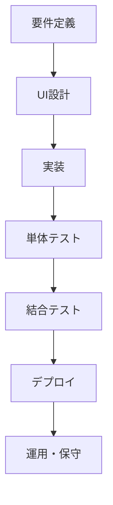

# 経費管理アプリケーション開発計画書

## 1. プロジェクト概要

### 1.1 目的
- PDF形式の領収書から経費情報を自動抽出し、JSON形式で管理する
- 経費データの一元管理と効率的な処理を実現する
- 申請書の自動生成を支援する

### 1.2 開発環境
- 言語: Python（メイン）
- UI: Tkinter（標準ライブラリ）
- 外部ツール: Node.js（オプション、必要に応じて使用）

## 2. 仕様

### ディレクトリ構造
- `display_json_data_gui.pyw` アプリ本体
- `requirements.txt` アプリケーションの依存パッケージを記載したテキストファイル
- `readme.md` 仕様書
- `logs` アプリケーション全体のログを格納
   - `app.log` アプリケーション全体のログ

これに加えて、経費ごとにフォルダ/ディレクトリを設置します。
各経費毎に次のような構造を構築します：

- `経費A` 経費Aのディレクトリです。ディレクトリ名がUIのテーブル名になります。
   - `setting.json` 経費Aの基本設定を行うjson. 構成は以下
      - テーブルのヘッダーと使用するjsonの対応
      - デフォルトのLLM設定ファイルのパス
   - `llm_config/` LLM設定用ディレクトリ
      - `gemini_receipt.json` Gemini API設定（領収書用）
      - `gpt4_delivery.json` GPT-4 API設定（納品書用）
   - `process/` 各処理に用いるスクリプト用ディレクトリ
      - `processA.py`
      - `processB.py`
      - `processB.js` Pythonで組んでいるため、Node.jsを利用する場合はprocessBから呼び出す
   - `profile/` 申請に用いるprofileを格納
      - `profileA.json` profile set A
      - `profileB.json` profile set B
   - `unprocessed/` フォルダ分けやjson生成前の領収書を格納するディレクトリ
   - `registered/` json生成後のディレクトリを格納するディレクトリ
      - `receiptA/` receiptA領収書に対応するディレクトリ（自動生成）
         - `receiptA.pdf` 処理元のPDF
         - `receiptA.json` PDFから生成されたJSONファイル（LLMでの生成を試みる）
         - その他ユーザーが追加したファイル
   - `applications/` 申請書を格納するディレクトリ
      - `20240315_1430/` 申請書フォルダ（日時）
         - `application.json` 申請情報
         - `expense_form.pdf` process出力
         - `attachments/` 必要に応じて添付資料
   - `logs/` 経費Aのログを格納
      - `process.log` 処理ログ
      - `error.log` エラーログ

### `display_json_data_gui.pyw` によるUI構成

`display_json_data_gui.pyw`はTkinterを用いて、
同じディレクトリ内のディレクトリを解析し、viewを作成します。
viewは次のように構成されます：

- tab: 同一ディレクトリ内のディレクトリ名
   - ツールバー
      - 更新ボタン: unprocessed内のPDFを処理するボタン
      - 総額表示: 使用額の総額を表示
      - 設定ボタン: 設定画面を表示
      - 処理ボタン: processのスクリプトを選択して実行するボタン。対象は処理対象☑が入っているもの
         - 申請書作成
         - 領収書データ以外の書類を利用したjson編集
      - CSV出力ボタン: 表示中のデータをCSVファイルとして出力
         - 出力対象: 表示中のデータ（非表示項目は除外）
         - 出力形式: UTF-8 with BOM
         - 出力項目: 表示中のカラムに従う
         - 出力先: ユーザーが選択したディレクトリ
         - ファイル名: 経費種別_YYYYMMDD_HHMMSS.csv
      - 非表示ボタン: 非表示のアイテムを表示させる
      - 削除ボタン(仕様検討中): 項目ではなく、領収書と申請書の削除を行うダイアログを表示する
         - 項目単位の削除は非表示か、ユーザーによるjsonの直接編集で行う
         - 削除する申請書、領収書を選択させる
         - 申請書の削除の場合
            - 申請書の参照先のitemのapplicationフィールドの値を空白に設定する
            - ディレクトリを削除
            - logに追加(削除したjsonの内容もlogに記載？)
         - 領収書データの場合
            - 全ての項目のapplicationフィールドが空なら削除
            - applicationフィールどが空でない場合は、警告して停止
            - 削除結果をログに記載　
   - 表
      - カラム構成
         - setting.json内のレシピに従って表示
         - 年、月、日、処理対象☑、json編集、領収書pdfはデフォルトで固定
      - セルの構成
         - JSON内の値 (profile等の場合は、リスト化して表示)
         - コピーボタン（任意）
         - リンクボタン（任意）: PDFの表示などに利用
         - 編集ボタン（任意）: JSONファイルが値の場合に、JSONの編集画面を表示
         - 処理対象☑ : システムによる自動生成(setting.jsonでの指定適用外)
   - ステータスバー（ウィンドウ下部）
      - 処理状態の表示
      - エラー数（赤色）
      - 警告数（黄色）
      - クリックでログ表示ウィンドウを開く

### 通知方式

1. **エラー発生時**
   - ステータスバーのエラー数が更新
   - エラー内容をステータスバーに表示

2. **警告発生時**
   - ステータスバーの警告数が更新
   - 警告内容をステータスバーに表示

3. **処理完了時**
   - 処理結果をステータスバーに表示
   - 成功時は緑色、失敗時は赤色で表示

### エラーハンドリング

アプリケーションは以下のエラーケースに対応します：

1. **ファイル操作エラー**
   - ファイルの読み書き失敗
   - ディレクトリの作成・削除失敗
   - 権限エラー

2. **PDF処理エラー**
   - PDFファイルの破損
   - 暗号化されたPDF
   - テキスト抽出失敗

3. **LLM処理エラー**
   - API接続エラー
   - レスポンスタイムアウト
   - 不正なレスポンス形式

4. **JSON処理エラー**
   - 不正なJSON形式
   - 必須フィールドの欠落
   - データ型の不一致

エラー発生時は以下の対応を行います：
- エラーログの記録
- ユーザーへの通知
- 可能な場合は代替処理の実行
- 処理の中断と再開ポイントの提供

### 設定ファイルの構造

#### setting.json
```json
{
  "table_headers": {
    "年": "payment_date.year",
    "月": "payment_date.month",
    "日": "payment_date.day",
    "経費種目": "expense_type",
    "発行元": "issuer",
    "品目": "items[*].product_name",
    "業者": "items[*].provider",
    "品番": "items[*].model",
    "個数": "items[*].number",
    "領収書等": "title",
    "関連処理": "related_process",
    "金額": "items[*].total_price"
  },
  "default_llm": "llm_config/gemini_receipt.json",
  "default_profile": "profile/profileA.json",
  "ui_settings": {
    "theme": "light",
    "font_size": "12px",
    "table_row_height": "40px",
    "copy_button": true,
    "pdf_button": true,
    "json_edit_button": true
  }
}
```

#### llm_config/gemini_receipt.json(sample)
```json
{
  "name": "Gemini API設定（領収書用）",
  "description": "Google Gemini APIの設定（領収書解析用）",
  "version": "1.0",
  "api_type": "gemini",
  "model": "gemini-1.5-pro-vision",
  "api_key_source": "environment",
  "api_key_env_var": "GeminiApiKey",
  "endpoint": "https://generativelanguage.googleapis.com/v1/models/gemini-2.0-flash-001:generateContent",
  "headers": {
    "Content-Type": "application/json"
  },
  "timeout": 30,
  "max_retries": 3,
  "prompt": {
    "name": "領収書解析プロンプト",
    "description": "領収書から情報を抽出するためのプロンプト",
    "version": "1.0",
    "prompt_template": "領収書または納品書の情報を解析し、購入項目ごとに以下の形式でJSONに構造化してください。ただし、以下の処理を施してください。\n+ 金額の部分はカンマがあれば除いてください\n+ 金額が0の項目は無視してください\n\n{ \"title\": \"領収書タイトル\", \"issuer\": \"発行者情報\", \"receiver_group\": \"受領者所属\", \"receiver_name\": \"受領者氏名(敬称、空白は除く)\", \"total_amount\": \"合計金額\", \"payment_date\": \"支払日\", \"items\": [ { \"product_name\": \"製品名(型番は抜く)\", \"provider\": \"メーカー\", \"model\": \"型番\", \"unite_price\": \"単価\", \"total_price\": \"金額\", \"number\": \"個数\", \"delivery_date\": \"発送日\" } ] }",
    "output_format": {
      "title": "string",
      "issuer": "string",
      "receiver_group": "string",
      "receiver_name": "string",
      "total_amount": "string",
      "payment_date": "string (YYYY/MM/DD)",
      "items": [
        {
          "product_name": "string",
          "provider": "string",
          "model": "string",
          "unite_price": "string",
          "total_price": "string",
          "number": "string",
          "delivery_date": "string (YYYY/MM/DD) or null"
        }
      ]
    }
  }
}
```

### 領収書JSONサンプル

#### registered/receiptA/receiptA.json (sample)
```json
{
  "title": "領収書",
  "issuer": "株式会社文具堂",
  "receiver_group": "情報システム部",
  "receiver_name": "山田太郎",
  "total_amount": "11000",
  "payment_year": "2024",
  "payment_month": "2",
  "payment_date": "29",
  "items": [
    {
      "product_name": "ノート",
      "provider": "コクヨ",
      "model": "A4-NO-123",
      "unite_price": "500",
      "total_price": "5000",
      "number": "10",
      "delivery_year": "2024",
      "delivery_month": "2",
      "delivery_date": "29",
      "display" : TRUE,
      "application": , #値は処理時に追加
      "memo": "" # 値はuserが追加
    },
    {
      "product_name": "ボールペン",
      "provider": "パイロット",
      "model": "BP-456",
      "unite_price": "300",
      "total_price": "6000",
      "number": "20",
      "delivery_year": "2024",
      "delivery_month": "2",
      "delivery_date": "29",
      "display" : TRUE,
      "application": , #値は処理時に追加
      "memo": "" # 値はuserが追加
    }
  ]
}
```

### ログ機能

アプリケーションは以下のログを記録します：

1. **アプリケーションログ**
   - 起動・終了
   - 設定の読み込み
   - エラー発生

2. **処理ログ**
   - PDF処理の開始・完了
   - LLM処理の開始・完了
   - ファイルの移動・生成

3. **エラーログ**
   - エラーの種類
   - エラー発生時のコンテキスト
   - スタックトレース

ログは以下の形式で保存：
- ログレベル（INFO, WARNING, ERROR）
- タイムスタンプ
- プロセスID
- メッセージ
- エラー詳細（エラーの場合）

ログファイルは以下の場所に保存：
- アプリケーション全体のログ: `logs/app.log`
- 経費ごとの処理ログ: `経費A/logs/process.log`
- 経費ごとのエラーログ: `経費A/logs/error.log`

ログのローテーション：
- 日次ローテーション
- 最大保持期間: 30日
- 最大ファイルサイズ: 10MB

### 補足事項

#### PDFフォーム入力について
- 現時点では、Node.jsを利用した場合のみPDFフォームへの入力が成功しています
- Pythonでの実装は現在開発中です
- PDFフォーム入力が必要な場合は、processディレクトリ内にNode.jsスクリプトを配置する必要があります 

## 開発フロー



## タスク

### GUI開発チーム
1. UI実装（Tkinter）
   - メインウィンドウのレイアウト
   - タブウィジェット/Notebookの実装
   - テーブルウィジェット/Treeviewの実装
   - ダイアログの実装
   - ステータスバーの実装
   - 申請書フォームの実装
   - プレビュー機能の実装
   - 保存機能の実装

### Python開発チーム
1. メインアプリケーションの実装
   - PDF処理ロジックの実装
   - JSON処理ロジックの実装
2. データベース設計・実装
   - スキーマ設計
   - マイグレーション
   - CRUD操作の実装
3. 外部API連携の実装
   - LLM APIの連携
   - その他外部サービスの連携

### インフラチーム
1. 開発環境の構築
   - ローカル開発環境のセットアップ
   - CI/CDパイプラインの構築
2. 本番環境の構築
   - クラウドインフラの設計
   - デプロイメントの自動化
3. 監視・ログ収集の実装
   - ログ収集システムの構築
   - モニタリングの設定

## 議論
- カード支払情報など、領収書データ以外のものを参照する場合の処理
- setting.jsonでのjsonの対象データを指定する必要はるか
- 領収書内に、複数の商品があった場合の処理をどうするか
   - `display`フィールどを追加して、項目単位の表示に対応

## 技術スタック

### フロントエンド
- Python 3.9+
- Tkinter（標準ライブラリ）
- tkinter.ttk（テーマ付きウィジェット）

### バックエンド処理
- pdfplumber (PDF解析)
- google-cloud-aiplatform (Gemini API)
- openai (GPT API)
- Node.js
   - 

### 開発ツール
- pytest (テスト)
- black (コードフォーマット)
- mypy (型チェック)
- poetry (依存関係管理)

### UIの詳細仕様

#### メインウィンドウ
- タイトル: 「経費管理システム」
- サイズ: 1280x800ピクセル（デフォルト）
- 最小サイズ: 800x600ピクセル
- 位置: 画面中央

#### タブ構成
- 各経費ディレクトリに対応するタブを表示
- タブの順序: アルファベット順
- タブの幅: コンテンツに応じて自動調整
- アクティブタブ: 青色でハイライト表示

#### ツールバー
- 高さ: 40ピクセル
- 背景色: #f0f0f0
- ボタン配置: 左寄せ
- ボタン間隔: 10ピクセル
- ボタンサイズ: 30x30ピクセル
- ボタンアイコン: 絵文字を使用
  - 更新: 🔄
  - 設定: ⚙️
  - 処理: ▶️
  - 非表示: ♻️
  - 削除: 🗑️
  - ヘルプ: ❓

#### テーブル
- 行の高さ: 40ピクセル（デフォルト、設定で変更可能）
- 行の色: 交互に白と薄いグレー（#f9f9f9）
- 選択行: 青色（#e6f3ff）
- フォント: メイリオ、12pt（デフォルト、設定で変更可能）
- ヘッダー: 固定表示、背景色 #e0e0e0
- スクロール: 垂直・水平スクロールバー表示

#### セル表示
- テキスト: 左寄せ
- 数値: 右寄せ
- 日付: 中央寄せ
- 長いテキスト: 省略表示（...）、ホバーで全文表示
- コピーボタン: 📋
- PDFボタン: 📄
- JSON編集ボタン: ✏️

#### ダイアログ
- モーダル表示
- 背景: 半透明の黒（#00000080）
- サイズ: コンテンツに応じて自動調整
- 最大サイズ: 画面の80%
- 位置: 画面中央
- タイトルバー: 背景色 #4a90e2、テキスト白色
- 閉じるボタン: 右上に配置

#### ステータスバー
- 高さ: 25ピクセル
- 背景色: #f0f0f0
- フォント: メイリオ、10pt
- エラー表示: 赤色（#ff0000）
- 警告表示: 黄色（#ffcc00）
- 成功表示: 緑色（#00cc00）
- ログ表示: クリックでダイアログ表示

#### テーマ設定
- ライトテーマ（デフォルト）
  - 背景色: #ffffff
  - テキスト色: #000000
  - アクセント色: #4a90e2
- ダークテーマ（オプション）
  - 背景色: #2d2d2d
  - テキスト色: #ffffff
  - アクセント色: #5c9ce6

#### レスポンシブ対応
- ウィンドウサイズ変更時に自動調整
- テーブル列幅: コンテンツに応じて自動調整
- 最小幅未満: 水平スクロールバー表示
- 高さ不足時: 垂直スクロールバー表示
